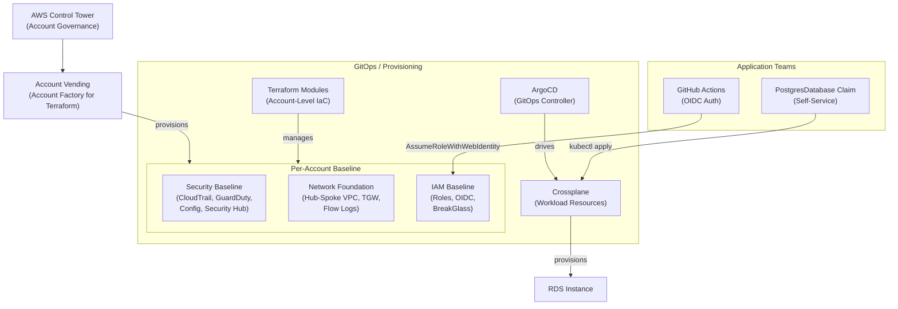

# TCS Cloud Foundations Reference Architecture

This document describes the repeatable AWS account baseline that TCS deploys as the foundation for all client cloud engagements. It covers account governance, network topology, identity and access, security controls, and the provisioning layer that ties them together.

The architecture is designed to be modular - clients with existing VPC setups or an established IAM structure can adopt individual layers without requiring the full stack. Each component is independently deployable and documented in the [tcs-cloud-foundations](https://github.com/tata-consulting/tcs-cloud-foundations) repository.

## Design Principles

**Least Privilege** - Every human role and service account is granted the minimum permissions necessary. IAM roles are scoped by job function. CI/CD pipelines use OIDC instead of long-lived credentials. PassRole is constrained to TCS-managed execution role prefixes.

**Defense in Depth** - Controls are applied at multiple layers: SCPs enforce account-level guardrails, IAM policies enforce per-resource permissions, and Security Hub aggregates findings across all layers. No single misconfiguration should result in a full account compromise.

**Automation-First** - Account provisioning, baseline configuration, and workload resource creation are all driven by code and version-controlled. Manual console changes are neither expected nor supported in the steady state.

**Everything via Code** - Terraform manages account-level infrastructure. Crossplane manages workload resources via Kubernetes CRDs. Both are driven from Git through CI/CD. Drift is either reconciled automatically (Crossplane) or surfaced as a Terraform plan diff.

**Drift Prevention** - Crossplane's reconciliation loop continuously compares desired state (in Git) with actual state (in AWS) and corrects deviations. AWS Config rules flag non-conformant resources. GuardDuty detects anomalous behavior indicative of out-of-band changes.

## Components

| Component | Purpose | Repo | Status |
|-----------|---------|------|--------|
| AWS VPC Module | Network foundation: public/private subnets, NAT, flow logs, TCS tagging | [tcs-cloud-foundations](https://github.com/tata-consulting/tcs-cloud-foundations/tree/main/modules/vpc) | Available |
| IAM Baseline Module | Identity and access: ReadOnly, Developer, PlatformEngineer, CICD, BreakGlass roles with MFA and OIDC | [tcs-cloud-foundations](https://github.com/tata-consulting/tcs-cloud-foundations/tree/main/modules/iam-baseline) | Available |
| Crossplane PostgresDatabase | Managed RDS provisioning via Kubernetes claim interface | [tcs-cloud-foundations](https://github.com/tata-consulting/tcs-cloud-foundations/tree/main/compositions/postgresql) | In Review |
| Security Baseline | CloudTrail, GuardDuty, AWS Config CIS rules, Security Hub aggregation | tcs-cloud-foundations | Planned |

## Getting Started

All Terraform modules and Crossplane compositions live in the [tcs-cloud-foundations](https://github.com/tata-consulting/tcs-cloud-foundations) repository. Start there for:

- Module source code and READMEs
- Usage examples under `examples/`
- Architecture decision records under `docs/decisions/`
- Meeting notes and design discussions under `docs/meetings/`

For questions about the reference architecture or to request a new composition, open an issue in [tcs-cloud-foundations](https://github.com/tata-consulting/tcs-cloud-foundations/issues).
