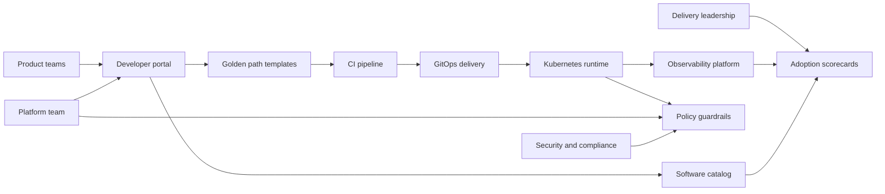

# Platform system context

This diagram captures the default consulting narrative: product teams enter through the portal, delivery is standardized through templates and GitOps, and operating signals roll up to scorecards.
